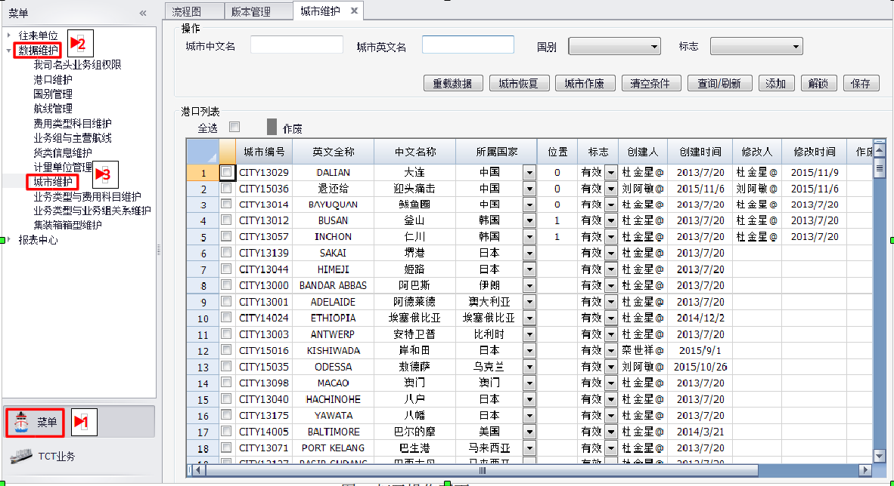
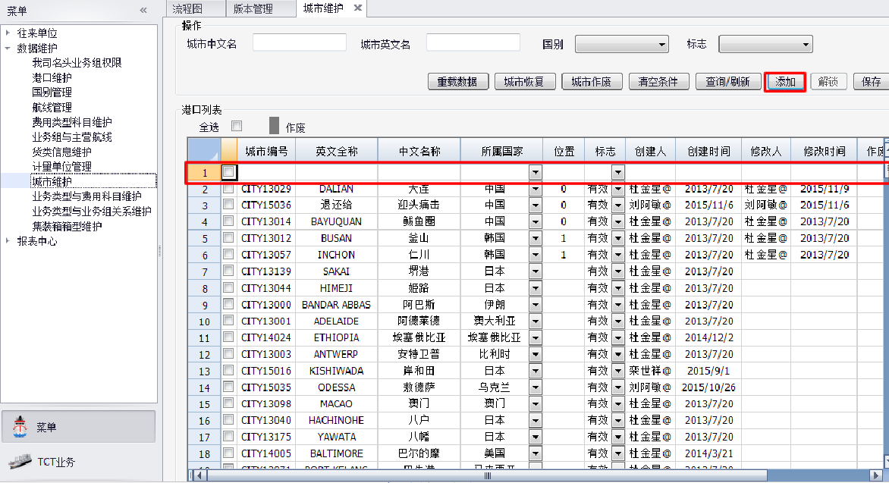
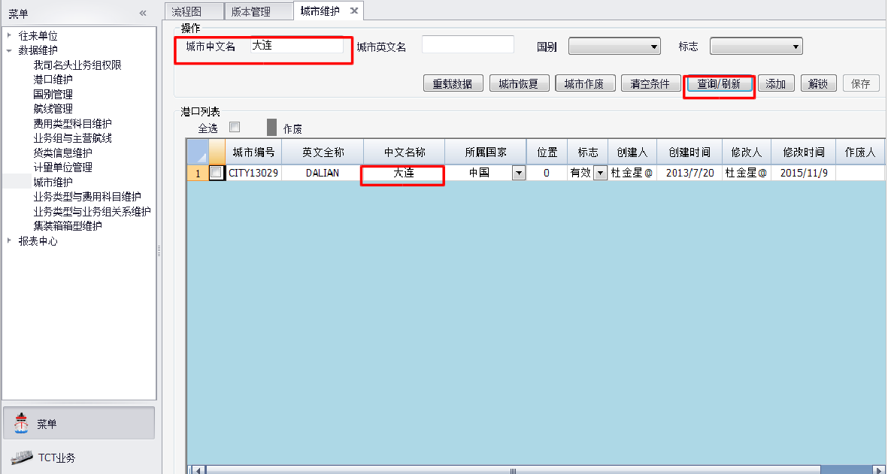
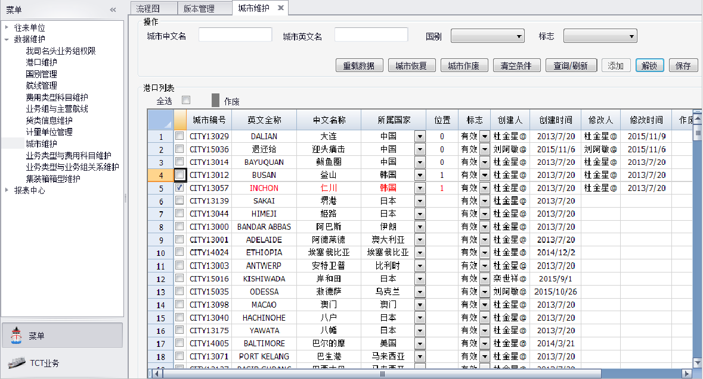

# 城市维护操作说明

### step1
首先按以下步骤打开如下操作页面（开始,运管中心,菜单,数据维护,城市维护）

### step2
点击添加按钮，港口列表会第一行会添加一行空行，此时可输入所要添加的内容，信息填写完可按保存按钮。

### step3
点击查询/刷新按钮，可根据操作框里的查询条件查询出相关的信息。

>**NOTE** 如果查询列表中有数据可点击清空条件按钮将数据全部清除。

### step4
如果想要修改信息首先选择想要修改的一行或多行，再点击解锁按钮，弹出提示确认后可进行数据的修改，修改后点击保存按钮即可。

